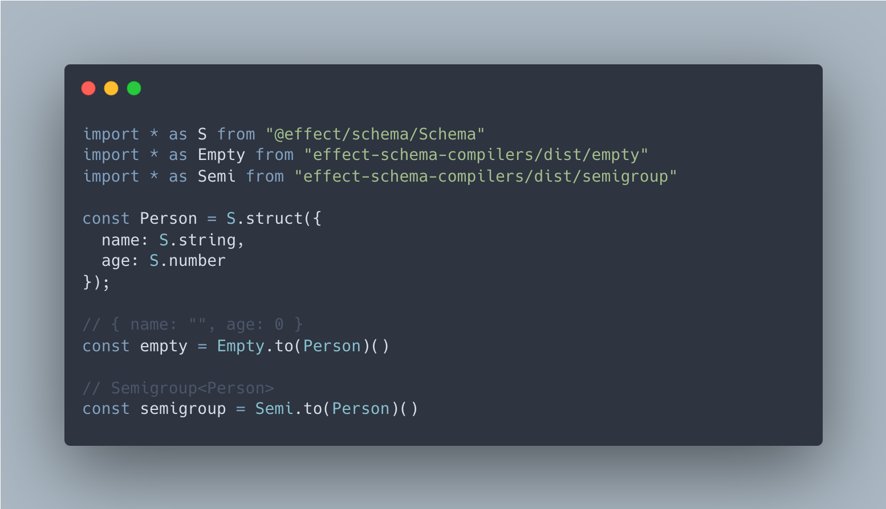

# effect-schema-compilers
Compilers for @effect/schema. Currently in **alpha**; although, the api is pretty simple and probably won't change too much. For a collection of types with preconfigured compilers see [effect-types](https://github.com/jessekelly881/effect-types)

[](https://npmjs.com/package/effect-schema-compilers)




### Current TODOs
- Convert to monorepo to allow supporting multiple compilers without dep issues. 
- Create compiler for avro
- Port JsonSchema and Typescript compilers from @effect/schema/test

## Empty

Generate "empty" values from a Schema. Similar to [zod-empty](https://github.com/toiroakr/zod-empty) with a similar motivation.

```ts
import * as E from "effect-schema-compilers/dist/empty";

const s = E.to(S.struct({ num: S.number, str: S.string }))(); // { num: 0, str: "" }
```

Also supports setting the empty value for a schema. E.g.

```ts
import * as E from "effect-schema-compilers/dist/empty";
import { pipe } from "@effect/data/Function";

const s = pipe(S.number, E.empty(() => 1), E.to()) // 1
```

## Semigroup

Generates a [Semigroup](https://effect-ts.github.io/data/modules/typeclass/Semigroup.ts.html) from the provided Schema. The default Semigroup.last is used which simply overrides the previous value.

```ts
import * as S from "@effect/schema/Schema";
import * as _ from "effect-schema-compilers/dist/semigroup";

const schema = S.struct({ a: S.number, b: S.string });
const { combine } = _.to(schema)()
expect(combine({ a: 0, b: "0" }, { a: 1, b: "1" })).toEqual({ a: 1, b: "1" })
```

The semigroup for a Schema can be set using the semigroup() fn. For example,

```ts
import * as S from "@effect/schema/Schema";
import * as Semi from "@effect/typeclass/Semigroup"'
import * as _ from "effect-schema-compilers/dist/semigroup";
import { pipe } from "@effect/data/Function";

const schema = S.struct({ 
    a: pipe(S.number, _.semigroup(Semi.min(n.Order))), 
    b: pipe(S.string, _.semigroup(Semi.string)),
    c: S.boolean
});

const { combine } = _.to(schema)()
expect(combine({ a: 0, b: "0", c: true }, { a: 1, b: "1", c: false })).toEqual({ a: 0, b: "01", c: false })
```

## Equivalence 

Generates an instance of [Equivalence](https://effect-ts.github.io/data/modules/typeclass/Equivalence.ts.html) for a given Schema.

```ts
import * as S from "@effect/schema/Schema";
import * as _ from "effect-schema-compilers/dist/equivalence";
import { pipe } from "@effect/data/Function";

const schema = S.literal("a", "b")
const eq = _.to(schema)(); // Equivalence<"a" | "b">

expect(eq("a", "b")).toBe(false)
```

The Equivalence for a Schema can be set using equivalence(). E.g. 

```ts
const person = S.struct({
    id: S.string,
    a: S.string
})

const schema = pipe(person, _.equivalence((a, b) => a.id === b.id))
const eq = _.to(schema)();

expect(eq({ id: "1", a: "a" }, { id: "1", a: "b" })).toEqual(true)
```

## Fakerjs

Generates realistic objects from a Schema using [fakerjs](@fakerjs/faker). 

```ts
import * as F from '@faker-js/faker';
import * as S from "@effect/schema/Schema"
import { pipe } from "@effect/data/Function";
import * as _ from "effect-schema-compilers/dist/faker";

const Person = S.struct({
    name: pipe(S.string, _.faker(f => f.person.fullName())),
    age: pipe(S.number, S.int(), S.greaterThanOrEqualTo(18), S.lessThanOrEqualTo(120)),
    sex: S.literal("male", "female")
});

const fakeData = _.to(Person)(F.faker) // { name: "Seth Gottlieb", age: 36, sex: "male" }
```
